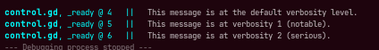
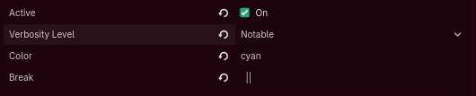
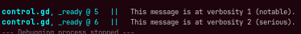
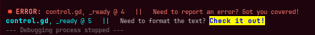

# I-say
Godot plugin that creates a new autoload singleton called I, with methods `I.say()` and `I.sayerr()`, for clean preformatted debug messaging. The header shows the script file, method, and line number of the function's call.

## Installation
Simply download and place the addons folder into your project files, then go to Project Settings/Plugins and enable the plugin called I.say().

### Compatibility
This plugin should work on all versions of Godot back to at least v4.4, with any project that does not currently have an autoload singleton called "I".

## How To Use
To use I-say, simply call `I.say()` for debug notes, or `I.sayerr()` for reporting errors.

### Verbosity Level
`I.say()` accepts three levels of verbosity: All, Notable, and Serious.

```
func _ready() -> void:
  I.say("This message is at the default verbosity level.") # I.LVL.all is the default value; equivalent to 0
  I.say("This message is at verbosity 1 (notable).", I.LVL.notable) # Equivalent to 1
  I.say("This message is at verbosity 2 (serious).", I.LVL.serious) # Equivalent to 2
```
Running this code returns the following:



### Changing Settings
When the plugin is active, new options are added to your Project Settings under Plugins/I-Say.



Here you can set:
* **Active**: Disabling it makes `I.say()` and `I.sayerr()` both stop printing.
* **Verbosity Level**: Changing the verbosity level makes all messages below that level stop printing.
* **Color**: This is the color of the formatted header. See the BBCode list of colors for the available colors.
* **Break**: The string that goes between the script header and the function's input. It is set by default to "``  ||  ``"



### Error Messages and Formatting
Because `I.say()` is modeled around `print_fancy()`, you can use BBCode to format the text it outputs. The same is not true of `I.sayerr()`.

```
func _ready() -> void:
	I.sayerr("Need to report an error? Got you covered!")
	I.say("Need to format the text? [bgcolor=yellow][color=blue][b]Check it out![/b][/color][/bgcolor]",2)
```


